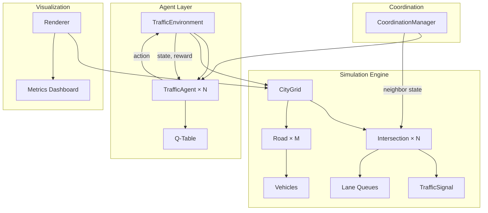

# Multi-Agent RL Smart Traffic Optimization System — Implementation Plan

## Problem Statement

Build a modular, extensible traffic simulator where **each intersection is controlled by an independent Q-learning agent**. Agents observe local traffic state + neighbor info and learn to minimize waiting time, queue length, and congestion across a city grid.

---

## System Architecture



### Module Breakdown

| Module | File(s) | Responsibility |
|---|---|---|
| **Grid & Graph** | `simulation/city_grid.py` | Build graph of intersections + roads |
| **Intersection** | `simulation/intersection.py` | Manage signal phases, lane queues |
| **Traffic Signal** | `simulation/traffic_signal.py` | Phase definitions, timing, switching |
| **Road & Lane** | `simulation/road.py` | Connect intersections, carry vehicles |
| **Vehicle** | `simulation/vehicle.py` | Position, route, waiting time |
| **Sim Runner** | `simulation/sim_runner.py` | Time-step loop, vehicle spawning |
| **RL Environment** | `agents/traffic_env.py` | Gym-like `reset()` / `step()` wrapper |
| **Q-Learning Agent** | `agents/q_agent.py` | Q-table, ε-greedy, update rule |
| **Coordination** | `agents/coordination.py` | Neighbor info sharing, green wave |
| **Visualization** | `visualization/renderer.py` | PyGame grid + metrics |
| **Config** | `config.py` | All tunable parameters in one place |
| **Main** | `main.py` | Entry point, mode selection |

---

## Core Class Design

### `Intersection`
```
- id: int
- position: (row, col)
- signal: TrafficSignal
- incoming_lanes: dict[Direction, Lane]   # N, S, E, W
- outgoing_lanes: dict[Direction, Lane]
- get_queue_lengths() -> dict
- get_total_waiting_time() -> float
```

### `TrafficSignal`
```
- phases: list[Phase]            # e.g. [NS_GREEN, EW_GREEN]
- current_phase_idx: int
- time_in_phase: int
- min/max_duration: int
- switch_phase(action)
- tick()
```

### `Road`
```
- from_intersection: Intersection
- to_intersection: Intersection
- lanes: list[Lane]
- length: int                    # number of cells
```

### `Lane`
```
- queue: deque[Vehicle]
- capacity: int
- direction: Direction
```

### `Vehicle`
```
- id: int
- route: list[Intersection]
- current_road: Road
- position: int                  # cell on road
- waiting_time: int
- move() / wait()
```

### `CityGrid`
```
- rows, cols: int
- intersections: dict[(r,c), Intersection]
- roads: list[Road]
- build_grid()
- get_neighbors(intersection) -> list[Intersection]
```

### `TrafficEnvironment` (Gym-like)
```
- grid: CityGrid
- agents: dict[int, TrafficAgent]
- reset() -> states
- step(actions) -> (states, rewards, done, info)
- _get_state(intersection) -> np.array
- _get_reward(intersection) -> float
```

### `TrafficAgent` (Q-Learning)
```
- q_table: dict[state_tuple, np.array]
- alpha, gamma, epsilon: float
- choose_action(state) -> int
- update(state, action, reward, next_state)
```

---

## State, Action & Reward Design

### State Space (per intersection)
| Feature | Range | Description |
|---|---|---|
| Queue N | 0–`max_q` | Vehicles queued from North |
| Queue S | 0–`max_q` | Vehicles queued from South |
| Queue E | 0–`max_q` | Vehicles queued from East |
| Queue W | 0–`max_q` | Vehicles queued from West |
| Current Phase | 0–1 | NS green (0) or EW green (1) |
| Neighbor Load | 0–`bins` | Discretized avg neighbor queue |

Discretized into bins (e.g. 0/low/med/high) to keep Q-table manageable.

### Action Space (per intersection)
| Action | Meaning |
|---|---|
| 0 | **Keep** current phase |
| 1 | **Switch** to next phase |

> [!NOTE]
> We start with 2 phases (NS-green / EW-green). Later phases can add left-turn signals.

### Reward Function
```
R = -α * total_waiting_time
    -β * max_queue_length
    -γ * throughput_penalty
```
Where `α=0.5, β=0.3, γ=0.2` (tunable in `config.py`).

---

## Phased Implementation Plan

### Phase 1 — Minimal Simulation (No RL)

Build the simulation engine with **2 intersections** connected by a road. Vehicles spawn randomly, move, and wait at red lights. Signals switch on a fixed timer.

#### Files to create:

| # | File | What it does |
|---|---|---|
| 1 | `config.py` | All constants (grid size, spawn rate, timings) |
| 2 | `simulation/traffic_signal.py` | Phase management, fixed-timer switching |
| 3 | `simulation/vehicle.py` | Vehicle data class |
| 4 | `simulation/road.py` | Road + Lane with queue logic |
| 5 | `simulation/intersection.py` | Intersection tying signal + lanes |
| 6 | `simulation/city_grid.py` | Graph builder (2 intersections initially) |
| 7 | `simulation/sim_runner.py` | Main loop: spawn, move, collect metrics |
| 8 | `main.py` | Run simulation, print per-step stats |

#### Acceptance criteria
- Vehicles spawn, traverse roads, wait at reds, and exit.
- Console output shows queue lengths and avg waiting time each step.

---

### Phase 2 — Single-Agent Q-Learning

Add an RL agent to **one** intersection. Compare learned policy vs. fixed timer.

| # | File | What it does |
|---|---|---|
| 1 | `agents/traffic_env.py` | Wraps simulation as RL environment |
| 2 | `agents/q_agent.py` | Q-table agent with ε-greedy |
| 3 | `main.py` (update) | Training loop + evaluation mode |

---

### Phase 3 — Multi-Agent (3×3 Grid)

Scale the grid, give each intersection its own agent, and add coordination.

| # | File | What it does |
|---|---|---|
| 1 | `agents/coordination.py` | Share neighbor queue info |
| 2 | `simulation/city_grid.py` (update) | Parameterized NxN grid |
| 3 | `main.py` (update) | Multi-agent train + eval |

---

### Phase 4 — Visualization

PyGame renderer showing the grid, vehicles, signals, and a metrics sidebar.

| # | File | What it does |
|---|---|---|
| 1 | `visualization/renderer.py` | PyGame drawing |
| 2 | `main.py` (update) | `--visualize` flag |

---

## Project Structure

```
OptiFlow/
├── config.py
├── main.py
├── requirements.txt
├── simulation/
│   ├── __init__.py
│   ├── city_grid.py
│   ├── intersection.py
│   ├── road.py
│   ├── traffic_signal.py
│   ├── vehicle.py
│   └── sim_runner.py
├── agents/
│   ├── __init__.py
│   ├── traffic_env.py
│   ├── q_agent.py
│   └── coordination.py
└── visualization/
    ├── __init__.py
    └── renderer.py
```

---

## Verification Plan

### Automated Tests

After Phase 1 completion, run the simulation directly:

```bash
cd /Users/ayushrthakur/Documents/OptiFlow
python main.py
```

**Expected output**: 50 time-steps of console logs showing vehicle counts, queue lengths, and average waiting time, with vehicles actually moving through the 2-intersection system.

### Manual Verification (Phase 1)

1. Run `python main.py` and observe console output.
2. Verify vehicles spawn, move between intersections, and wait at red lights.
3. Queue lengths should fluctuate (not always 0, not always maxed).
4. Average waiting time should be > 0 (vehicles do wait at reds).

> [!IMPORTANT]
> **We will build Phase 1 first and pause for your review before proceeding to Phase 2.** Each phase is designed to be independently runnable and testable.
